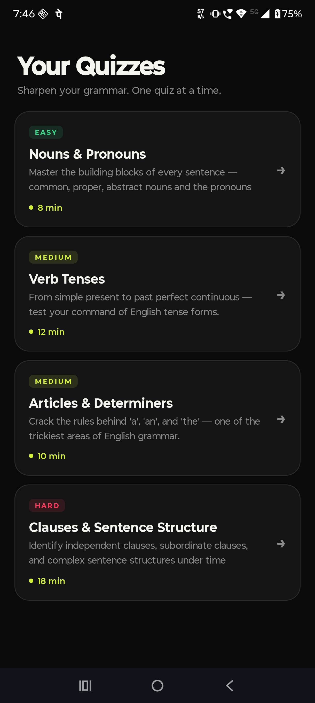
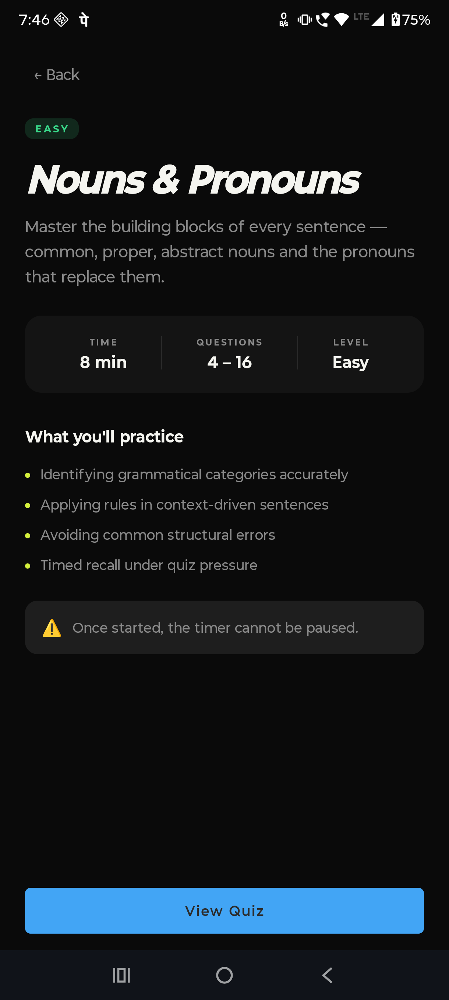
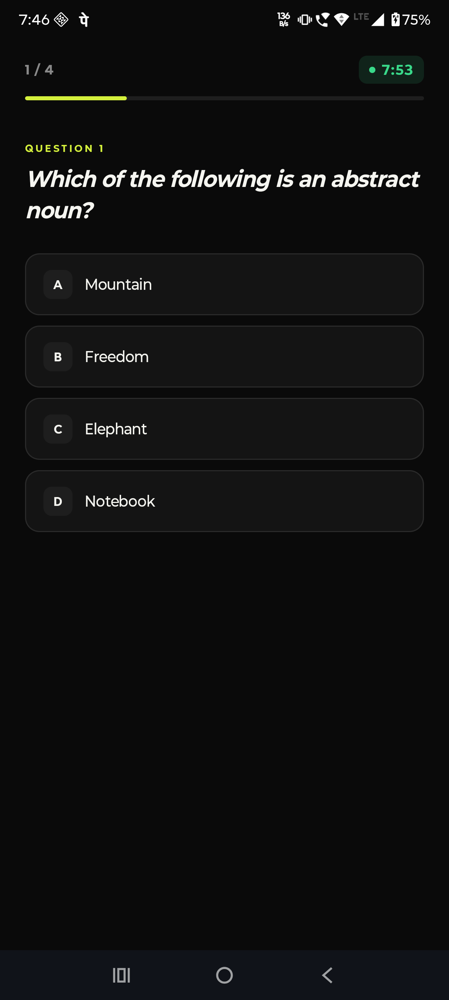
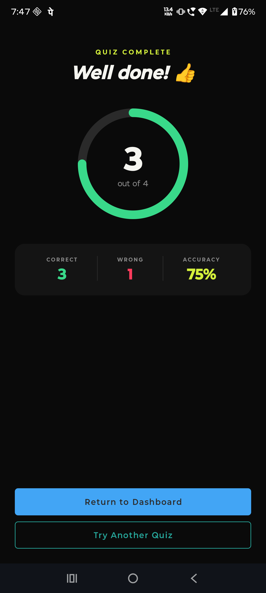

# GrammarFlow

A lightweight, offline-first Android application for English grammar practice through timed, persistent multiple-choice quizzes. The application operates entirely without a network connection; all content is seeded locally into a Room database on first launch.

**Watch the Full Technical Walkthrough:**
[](https://www.youtube.com/watch?v=lJ3xhXYaJoc)
---
## Screenshots

| Home Dashboard | Quiz Detail | Quiz Engine |                     Results                     |
| :---: | :---: | :---: |:-----------------------------------------------:|
|  |  |  |  |
## Tech Stack

* **UI Toolkit:** Jetpack Compose with Lumo UI (high-contrast OLED backgrounds, squircle geometry).
* **Architecture:** Strict Clean Architecture (Domain, Data, Presentation), MVVM, and Unidirectional Data Flow (UDF).
* **Dependency Injection:** Koin 3.5+ (chosen over Hilt for zero annotation-processing overhead).
* **Persistence:** Room Database mapped with Kotlin Coroutines and kotlinx.serialization.
* **Routing:** Type-Safe Navigation Compose (Navigation 2.8+).

---

## Architecture & Package Structure

GrammarFlow enforces a strict three-layer Clean Architecture. The Domain layer is pure Kotlin, completely isolated from Android framework imports and Room annotations, ensuring independent testability.

```text
com.grammarflow
|-- core/di/                  (Koin modules: Database, Domain, Repository, ViewModel)
|-- data/                     (Room entities, DAOs, Repository implementations, Mappers)
|-- domain/                   (Models, Repository interfaces, Use Cases)
|-- presentation/navigation/  (Type-safe route definitions and AppNavigation host)
|-- presentation/             (Compose screens and ViewModels grouped by feature)
```

---

## Engineering Highlights

**Offline-First Pre-population**
The SQLite database is seeded locally on a background coroutine (`Dispatchers.IO`) via a `RoomDatabase.Callback` during the app's 1.5-second splash screen, ensuring instant offline availability without empty states.

**Startup Performance**
`AppDatabase` allocation is explicitly pushed off the main thread during Koin resolution. The `SplashViewModel` pre-warms the singleton concurrently with the splash timer, preventing a ~7.8ms UI-thread block during the initial `HomeViewModel` injection.

**Precise State Management**
Mitigated Jetpack Compose recomposition artifacts (state flickering between rapid question transitions) by wrapping UI nodes in `key(question.id)` blocks. This forces atomic node recreation alongside Compare-And-Swap (CAS) `_state.update` loops in the ViewModel, ensuring a tear-free UI.

**Navigation Safety**
Eliminated duplicate modal bottom sheets and stale navigation states by deriving dialog triggers reactively from `currentBackStackEntryAsState()`. This ties UI enablement strictly to the navigation back-stack truth rather than local, easily desynced composable booleans.

---

## Getting Started

1. Clone the repository: `git clone https://github.com/blue-mix/QuizAssignment.git`
2. Open the project in Android Studio (Hedgehog or later).
3. Run the `app` configuration on an emulator or physical device (Minimum SDK 26, target SDK 35). No API keys or network configurations are required.